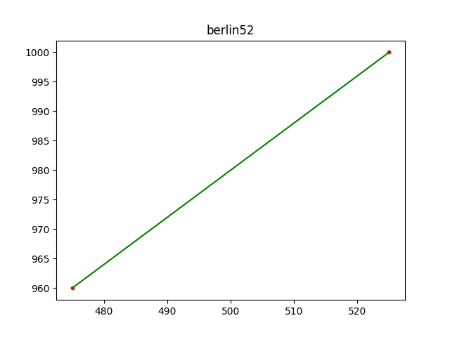
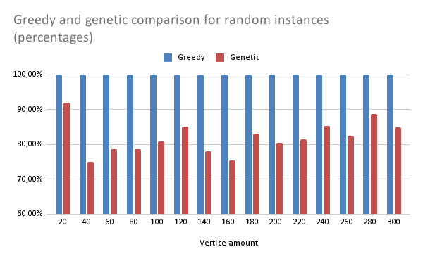
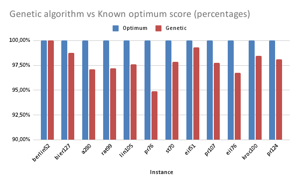

# Genetic Algorithm for Traveling Salesman Problem

## Performance charts

## Overview

- Greedy solution included (just go to the nearest unvisited vertice).
- Tuning parameters.
- Performance boost thanks to IGX crossover method.
- For big amount of vertices its recommended to use at least few greedy solutions at the start.

## Instance format:
N
i X Y

Where N is the number of the graph vertices and for i=1,...,N there are a X and Y integer coordinates for each vertice.

## Credits:

### Author
Mateusz Olewnik

### Sources of knowledge
- 'Greedy Mutation' tuning method: [Peter Hurford github repo](https://github.com/peterhurford/travelling_salesman)
- [Amazing Improved Greedy Crossover method](https://www.researchgate.net/publication/230996799_Developing_Improved_Greedy_Crossover_to_Solve_Symmetric_TravelingSalesman_Problem)
- [Doubly Circular Linked List structure](https://www.askpython.com/python/examples/doubly-circular-linked-list)
